# Edge Conversational Agent

Local pipeline: **Audio → ASR (Whisper) → RAG → LLM → TTS**, with end-to-end latency measurement (mock edge).

## Pipeline diagram
### Overview

```mermaid
flowchart LR
    subgraph input[" "]
        A[🎤 Audio]
    end
    subgraph processing["Pipeline"]
        B["ASR<br/>(Speech-to-Text)"]
        C["RAG<br/>(Retrieval)"]
        D["LLM<br/>(Language Model)"]
        E["TTS<br/>(Text-to-Speech)"]
    end
    subgraph output[" "]
        F[🔊 Audio]
    end
    A --> B
    B --> C
    C --> D
    D --> E
    E --> F
```




### RAG systems for real-time information retrieval (News, Websearch, Weather) with LLM reasoning 

```mermaid
flowchart LR
    A[Audio] --> B["ASR<br/>(Whisper)"]
    B --> L1["LLM<br/>(reasoning + routing)"]
    L1 --> R["RAG<br/>(FAISS – static knowledge)"]
    L1 --> T["Tool<br/>(News / Weather / Web)"]
    R --> L2["LLM<br/>(compose answer)"]
    T --> L2
    L2 --> E["TTS<br/>(Piper)"]
    E --> F[Audio out]

    style B fill:#e1f5fe
    style L1 fill:#fff3e0
    style R fill:#e8f5e9
    style T fill:#f3e5f5
    style L2 fill:#fff3e0
    style E fill:#fce4ec
```



**Note**:
The diagram represents the intended production architecture.
The current implementation focuses on validating the core data flow and model interactions; asynchronous tool execution and fallback strategies are documented but not fully implemented in code.

**Details:** [docs/pipeline-diagram.md](docs/pipeline-diagram.md) — detailed diagram, latency table, pipeline + tool calling (async).

## Setup

```bash
python -m venv .venv
source .venv/bin/activate  # or .venv\Scripts\activate on Windows
pip install -r requirements.txt
```

- **Ollama**: Install and run [Ollama](https://ollama.ai), then `ollama pull llama3.2`.
- **Piper TTS**: Voice models are downloaded on first use (or place `.onnx` + `.json` in config).

## Config ASR model

Configure ASR in `config/pipeline.yaml` → `asr`:

| Option       | Description |
|-------------|-------------|
| `model_name` | Hugging Face model ID (e.g. `openai/whisper-small`, `vinai/PhoWhisper-small`) or path to a local model directory after fine-tuning (e.g. `models/whisper-small-vivos`). |
| `device`     | `auto` (default: use CUDA if available, else CPU), `cpu`, or `cuda`. |
| `language`   | `null` or `"auto"` = Whisper auto-detects language from audio; `"vi"`, `"en"` = force language (use when input language is known). |

**Examples:**

- **Vietnamese (PhoWhisper):**  
  `model_name: vinai/PhoWhisper-small` and `language: vi`.
- **English (stock Whisper):**  
  `model_name: openai/whisper-small` and `language: en`.
- **Local fine-tuned model:**  
  After training (see [Fine-tune Whisper](#fine-tune-whisper-vn--en)), set `model_name: models/whisper-small-vivos` (or your output directory).

Models are downloaded from Hugging Face on first run; local models are loaded directly from the path in `model_name`.

## Run demo

```bash
python scripts/run_demo.py path/to/audio.wav
```

Optional: `MOCK_EDGE=1 python scripts/run_demo.py audio.wav` to simulate edge (reduced threads).

## Fine-tune Whisper (VN + EN)

Place VN+EN audio and transcripts in `data/whisper/`. Full details: [data/whisper/README.md](data/whisper/README.md).

**Note:** [PhoWhisper](https://huggingface.co/vinai/PhoWhisper-small) checkpoints provide strong Vietnamese baselines, achieved through large-scale fine-tuning on hundreds of hours of speech data.
The fine-tuning experiments in this repository are deliberately small-scale and focus on understanding adaptation behavior, overfitting risks, and safe training strategies, rather than producing deployable models or matching large-scale training results.

### Manifest format

Use a manifest CSV or JSON with columns:

- **path**: relative path to WAV file (from `data/whisper/`) or absolute path
- **text**: transcript (Vietnamese or English)
- **language**: `vi` or `en`

Example `manifest.csv`:

```csv
path,text,language
clips/sample_vi_001.wav,Xin chào đây là mẫu tiếng Việt.,vi
clips/sample_en_001.wav,This is a sample English sentence.,en
```

Or load from Hugging Face: e.g. `mozilla-foundation/common_voice_17_0` with config `vi` and `en` (see `scripts/train_whisper.py --dataset`).

### VIVOS subset (30–60 min)

If using [VIVOS](https://www.kaggle.com/datasets/kynthesis/vivos-vietnamese-speech-corpus-for-asr) (Vietnamese speech corpus ~15h):

1. Place the data under `data/whisper/vivos/train/` (with `prompts.txt` and `waves/`).
2. Build a 30–60 min subset and manifest:
   ```bash
   python scripts/build_vivos_subset.py --min-min 30 --max-min 60
   ```
   Output: `data/whisper/vivos_subset_manifest.csv`.
3. Fine-tune **decoder-only**, 1–2 epochs:
   ```bash
   python scripts/train_whisper.py \
     --manifest data/whisper/vivos_subset_manifest.csv \
     --num-train-epochs 2 \
     --lr 1e-5 \
     --output-dir models/whisper-small-vivos
   ```
   By default the encoder is frozen (only the decoder is trained). `--lr` is learning rate (default 3e-5). Omit `--num-train-epochs` and use `--max-steps` if you want to train by step count.

### Audio

- Format: WAV, 16 kHz mono preferred (script will resample if needed).
- Short clips (e.g. 3–30 s) are fine; long files may be truncated to 30 s.

After training, set `config/pipeline.yaml` → `asr.model_name` to your saved model path (e.g. `models/whisper-small-vivos`).

## Project layout

- `config/pipeline.yaml` – model paths, RAG/LLM/TTS config
- `src/asr/` – Whisper ASR (Hugging Face Transformers; same stack as fine-tuning)
- `src/rag/` – RAG (Faiss + sentence-transformers)
- `src/llm/` – Ollama client
- `src/tts/` – Piper TTS
- `src/pipeline.py` – orchestration
- `src/latency.py` – per-stage and E2E latency
- `scripts/run_demo.py` – demo + latency report
- `scripts/train_whisper.py` – Whisper fine-tuning (VN+EN); inference uses same HF checkpoint

## License
This project is licensed under the Apache License 2.0.<br>
See the [LICENSE](LICENSE) file for details.
