# Edge Conversational Agent

Local pipeline: **Audio → ASR (Whisper) → RAG → LLM → TTS**, with end-to-end latency measurement (mock edge).

## Pipeline diagram
### Overview

```mermaid
flowchart LR
    subgraph input[" "]
        A[🎤 Audio]
    end
    subgraph processing["Pipeline"]
        B["ASR<br/>(Speech-to-Text)"]
        C["RAG<br/>(Retrieval)"]
        D["LLM<br/>(Language Model)"]
        E["TTS<br/>(Text-to-Speech)"]
    end
    subgraph output[" "]
        F[🔊 Audio]
    end
    A --> B
    B --> C
    C --> D
    D --> E
    E --> F
```




### RAG systems for real-time information retrieval (News, Websearch, Weather) with LLM reasoning 

```mermaid
flowchart LR
    A[Audio] --> B["ASR<br/>(Whisper)"]
    B --> L1["LLM<br/>(reasoning + routing)"]
    L1 --> R["RAG<br/>(FAISS – static knowledge)"]
    L1 --> T["Tool<br/>(News / Weather / Web)"]
    R --> L2["LLM<br/>(compose answer)"]
    T --> L2
    L2 --> E["TTS<br/>(Piper)"]
    E --> F[Audio out]

    style B fill:#e1f5fe
    style L1 fill:#fff3e0
    style R fill:#e8f5e9
    style T fill:#f3e5f5
    style L2 fill:#fff3e0
    style E fill:#fce4ec
```



**Note**:
The diagram represents the intended production architecture.
The current implementation focuses on validating the core data flow and model interactions; asynchronous tool execution and fallback strategies are documented but not fully implemented in code.

**Details:** [docs/pipeline-diagram.md](docs/pipeline-diagram.md) — detailed diagram, latency table, pipeline + tool calling (async).

## Setup

```bash
python -m venv .venv
source .venv/bin/activate  # or .venv\Scripts\activate on Windows
pip install -r requirements.txt
```

- **Ollama**: Install and run [Ollama](https://ollama.ai), then `ollama pull llama3.2`.
- **Piper TTS**: Voice models are downloaded on first use (or place `.onnx` + `.json` in config).

## Run demo

```bash
python scripts/run_demo.py path/to/audio.wav
```

Optional: `MOCK_EDGE=1 python scripts/run_demo.py audio.wav` to simulate edge (reduced threads).

## Fine-tune Whisper (VN + EN)

1. Place VN+EN audio + transcripts in `data/whisper/` (see `scripts/train_whisper.py` for format).
2. Run: `python scripts/train_whisper.py`
3. Update `config/pipeline.yaml` → `asr.model_name` to your saved model path (e.g. `models/whisper-small-vien`).

## Project layout

- `config/pipeline.yaml` – model paths, RAG/LLM/TTS config
- `src/asr/` – Whisper ASR (Hugging Face Transformers; same stack as fine-tuning)
- `src/rag/` – RAG (Faiss + sentence-transformers)
- `src/llm/` – Ollama client
- `src/tts/` – Piper TTS
- `src/pipeline.py` – orchestration
- `src/latency.py` – per-stage and E2E latency
- `scripts/run_demo.py` – demo + latency report
- `scripts/train_whisper.py` – Whisper fine-tuning (VN+EN); inference uses same HF checkpoint
