# Pipeline: Audio → ASR → RAG → LLM → TTS

## Flow diagram (overview)

```mermaid
flowchart LR
    subgraph input[" "]
        A[🎤 Audio]
    end
    subgraph processing["Pipeline"]
        B["ASR<br/>(Speech-to-Text)"]
        C["RAG<br/>(Retrieval)"]
        D["LLM<br/>(Language Model)"]
        E["TTS<br/>(Text-to-Speech)"]
    end
    subgraph output[" "]
        F[🔊 Audio]
    end

    A --> B
    B --> C
    C --> D
    D --> E
    E --> F
```



## Detailed version 


## Run pipeline

```bash
source .venv/bin/activate   # or: . .venv/bin/activate
python scripts/run_demo.py data/whisper/clips/VIVOSSPK12_R011.wav
```

## Latency

| Stage | Field | Description | Benchmark (MacBook 14" M2 Pro) |
|-------|--------|-------------|-------------------------------|
| ASR | `asr_ms` | Speech-to-text time (ms) | **4487** ms |
| RAG | `rag_ms` | Retrieval time from vector DB (ms) | **11** ms |
| LLM | `llm_ms` | Text generation time (ms) | **2574** ms |
| TTS | `tts_ms` | Speech synthesis time (ms) | **575** ms |
| **E2E** | `e2e_ms` | Total end-to-end latency (ms) | **7647** ms |
| **RTF** | `rtf` | Real-time factor = E2E / duration(audio) | **2.98** |

**Formula:** `e2e_ms = asr_ms + rag_ms + llm_ms + tts_ms` (+ overhead). RTF < 1 = response faster than audio duration.

## Pipeline + Tool calling (async)

Flow: ASR → **LLM (reasoning + routing)** decides whether to call **Tool (News / Weather / Web)** and/or **RAG (FAISS – static knowledge)** or neither; results go back to the same **LLM (compose answer)** to produce the final reply, then TTS.

```mermaid
flowchart LR
    A[Audio] --> B["ASR<br/>(Whisper)"]
    B --> L1["LLM<br/>(reasoning + routing)"]
    L1 --> R["RAG<br/>(FAISS – static knowledge)"]
    L1 --> T["Tool<br/>(News / Weather / Web)"]
    R --> L2["LLM<br/>(compose answer)"]
    T --> L2
    L2 --> E["TTS<br/>(Piper)"]
    E --> F[Audio out]

    style B fill:#e1f5fe
    style L1 fill:#fff3e0
    style R fill:#e8f5e9
    style T fill:#f3e5f5
    style L2 fill:#fff3e0
    style E fill:#fce4ec
```



**Logic (async; user does not wait for tool):**

- **As soon as ASR finishes**, run **in parallel**:
  - LLM starts reasoning (and/or routing to RAG/Tool).
  - Tool request is sent (News / Weather / Web).
- **If tool returns in time:** inject result into context → LLM (compose answer) uses it.
- **If not in time:** fallback to cached / generic answer.
- **User does not wait for tool;** response still comes on time (with or without tool data).
